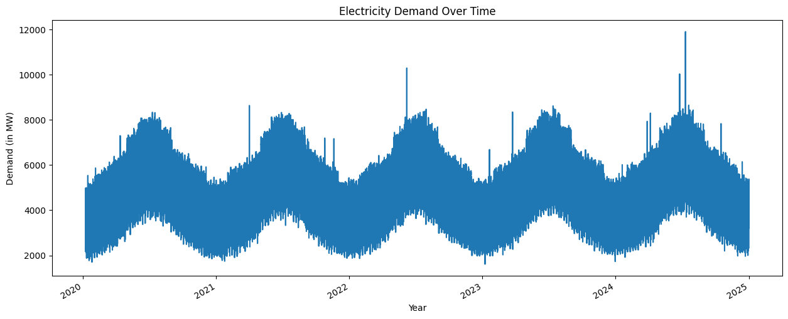
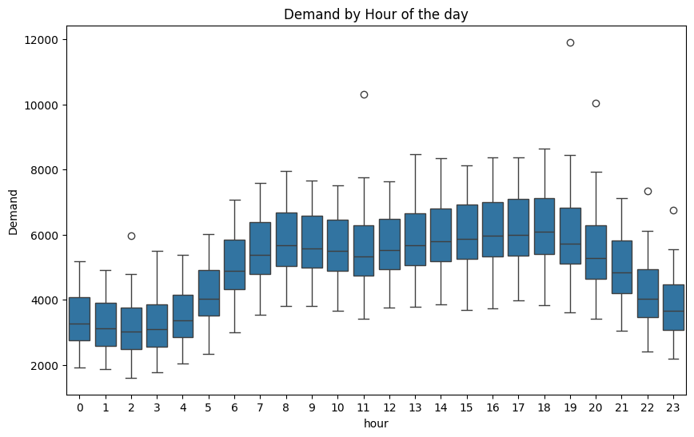
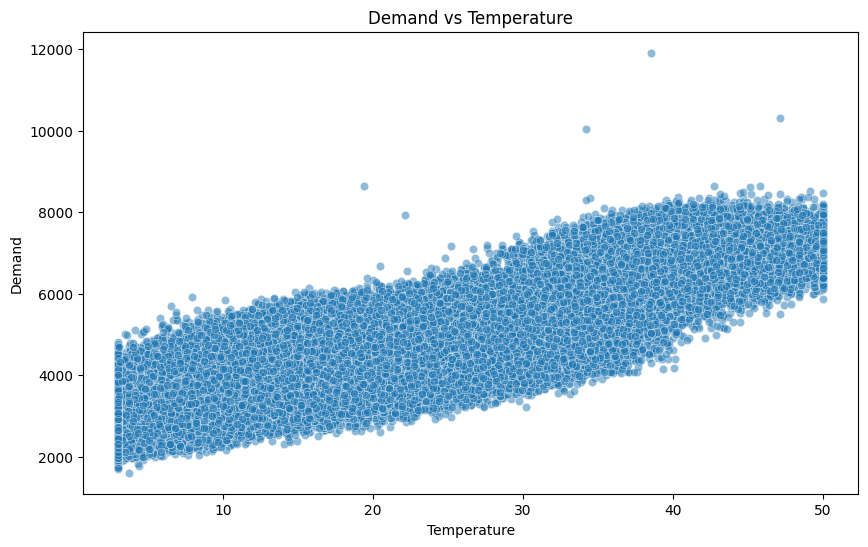
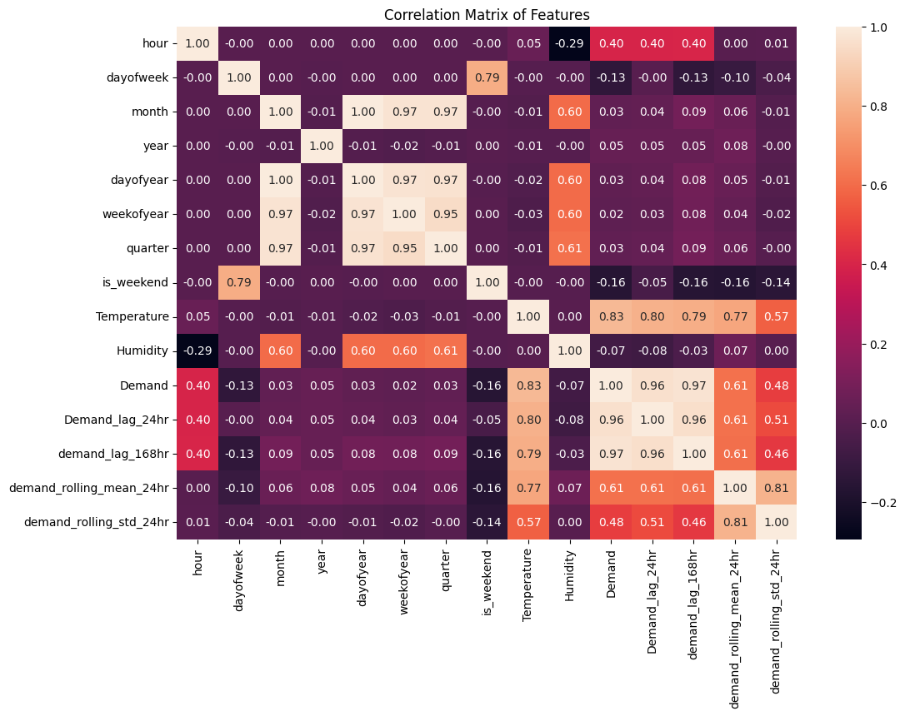
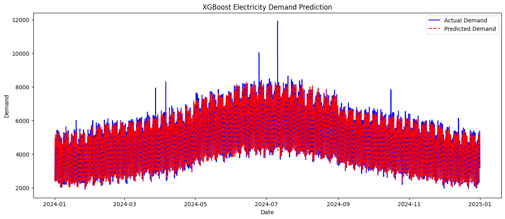

# Electricity Demand Forecasting Pipeline

This project implements a robust, end-to-end electricity demand forecasting pipeline using traditional Machine Learning (XGBoost) and a modern Foundation Model (Google's TimesFM). The system is integrated with DuckDB for high-performance data storage and model reporting.

## 🚀 Key Features

- **Hybrid Modeling**: Compare the performance of a trained **XGBoost** model against **TimesFM 2.0** (500M parameters) zero-shot forecasting.
- **DuckDB Integration**: 
    - `electricity_data.db`: Stores cleaned demand records (43k+ rows) with sub-second query performance.
    - `model_reports.db`: Tracks model metrics (RMSE, MAE, MAPE) and predictions for historical comparison.
- **Advanced Feature Engineering**: Incorporates time-based features (hour, day, month, season), weather covariates (temperature, humidity), and lagged demand (24h and 168h).
- **Streamlit Dashboard**: Interactive UI to visualize forecasts, compare model results, and explore historical trends.
- **Scalable Infrastructure**: Designed for rolling window evaluation across years of hourly data.

---

## 📊 Visual Insights

### Demand Trends
The dataset exhibits strong daily and seasonal seasonality, with significant correlations to ambient temperature.

| Demand Over Time | Demand by Hour |
|:---:|:---:|
|  |  |

### Environmental Impact
Temperature is a primary driver of electricity demand, showing a non-linear relationship (heating/cooling loads).

| Demand vs Temperature | Correlation Matrix |
|:---:|:---:|
|  |  |

### XGBoost Results
The XGBoost model achieves high accuracy by capturing local patterns and weather dependencies.



---

## 🛠 Project Structure

```text
.
├── electricity demand forecasting.ipynb          # Main XGBoost pipeline
├── timesfm_electricity_demand_forecasting.ipynb  # TimesFM 2.0 implementation
├── app.py                                        # Streamlit dashboard
├── electricity_data.db                           # DuckDB: Demand records
├── model_reports.db                              # DuckDB: Model performance tracking
├── images/                                       # Exported visualizations
├── ELECTRICITY_SCHEMA_SKILL.md                   # Database schema documentation
├── Forecasting_Skill.md                          # Forecasting SOPs
└── Reporting_Skill.md                            # Model reporting guidelines
```

---

## 🚦 Getting Started

### 1. Prerequisites
Ensure you have Python 3.10+ installed.

```bash
pip install pandas numpy matplotlib seaborn xgboost duckdb timesfm streamlit
```

### 2. Database Initialization
The data is automatically loaded and cleaned from `electricity demand dataset.csv` during the first run of the XGBoost notebook.

### 3. Running the Models
- **XGBoost**: Open and run `electricity demand forecasting.ipynb`.
- **TimesFM**: Open and run `timesfm_electricity_demand_forecasting.ipynb`. Note: 500M model requires significant memory/CPU for rolling forecasts.

### 4. Launching the Dashboard
```bash
streamlit run app.py
```

---

## 📈 Model Performance (Sample)

| Model | RMSE | MAE | MAPE |
| :--- | :--- | :--- | :--- |
| **XGBoost** | 173.65 | 122.85 | 2.57% |
| **TimesFM** | *Pending* | *Pending* | *Pending* |

---

## 📜 Documentation & Skills
This repository includes specialized "Skill" files that define the project's standard operating procedures:
- **[Forecasting_Skill.md](Forecasting_Skill.md)**: Guidelines for feature engineering and model training.
- **[Reporting_Skill.md](Reporting_Skill.md)**: Standardized 5-step model reporting process.
- **[ELECTRICITY_SCHEMA_SKILL.md](ELECTRICITY_SCHEMA_SKILL.md)**: DuckDB table structures and validation rules.
